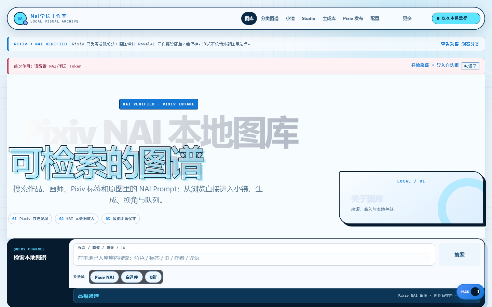
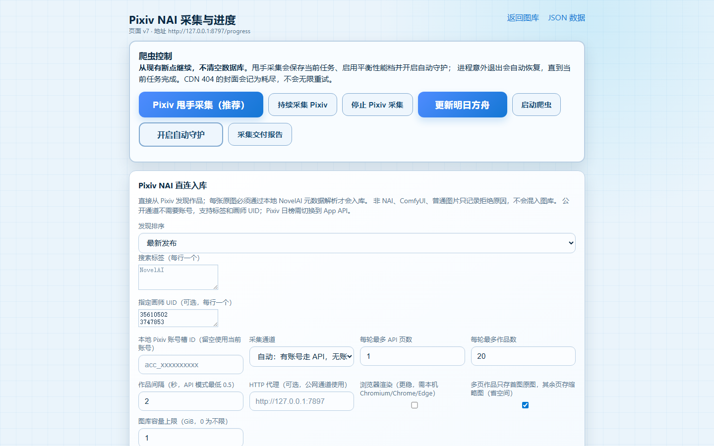
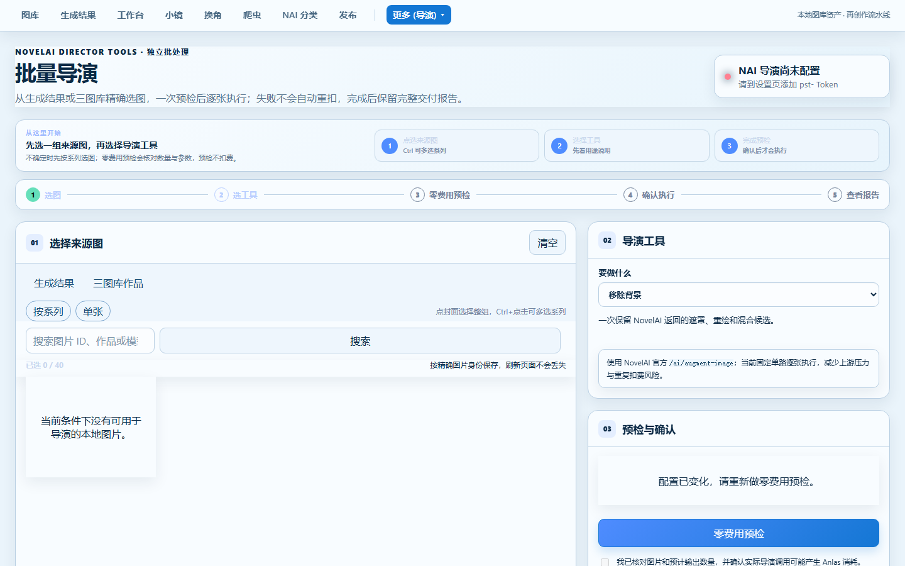

# Nai学长工作室（Pixiv NAI Gallery）

本地优先的 **Pixiv NAI 作品管理 + AI 创作工作台**。Windows 便携版，解压即用。

> 当前为**预览版**：仅通过 GitHub Releases 提供完整安装包，源码暂不公开。

## 它能做什么

- **Pixiv 无账号采集**：无需 Pixiv 账号即可按搜索标签/画师/榜单采集，自动验证 NovelAI 元数据并入库；有账号可选 App API 通道，更稳定
- **但丁 AI 智能管家**：自然语言指挥——"看看收藏最高的作品"、"帮我启动爬虫"、"按这个画风批量生成"；报错直接贴给它，自动诊断修复；可开启最大权限自动化
- **NAI 批量导演**：批量去背景、提取线稿、生成草图、上色、表情修改、画面清理（NovelAI Director Tools）
- **换角 / 换画风**：一键替换角色或画风重新生成，保留原构图
- **自选库**：本地图片拖入即建库（NAI 作品自动读元数据，非 NAI 自动隔离）
- **投稿准备**：补齐后处理与文案，停在人工上传前（Pixiv 上传始终由你亲手确认）

## 截图

| 图库首页 | 采集页 | 批量导演 |
|---|---|---|
|  |  |  |

## 下载

- **[v1.1.0（最新）→ Releases](https://github.com/h1neolzr7f/NaiXueZhang-Studio/releases)**
- 绿色便携版：下载 zip → 解压 → 双击 `START_GALLERY.bat` → 浏览器自动打开 `http://127.0.0.1:8787/`
- 首次使用：先到采集页添加搜索标签启动采集（无账号即可），或把图片拖进自选库；图库有初始数据后即可浏览、生成、导演

## 隐私与边界

- **纯本地运行**，无账号、无遥测、无云同步；数据只存在你的电脑上
- AI 对话走你自配的 DeepSeek/OpenAI 兼容接口，密钥只保存在本机（DPAPI 加密）
- 上传统一停在人工确认：AI 永远不会自动投稿

## 已知限制（预览版）

- 仅 Windows 10/11 x64
- 采集质量依赖网络到 www.pixiv.net 的连通性，必要时在采集页配置代理
- 更多功能打磨中，欢迎反馈

## License

All rights reserved. 本仓库仅发布软件产物与产品介绍，**源码与核心实现不公开**，禁止复制、魔改、再分发。
