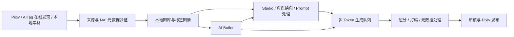
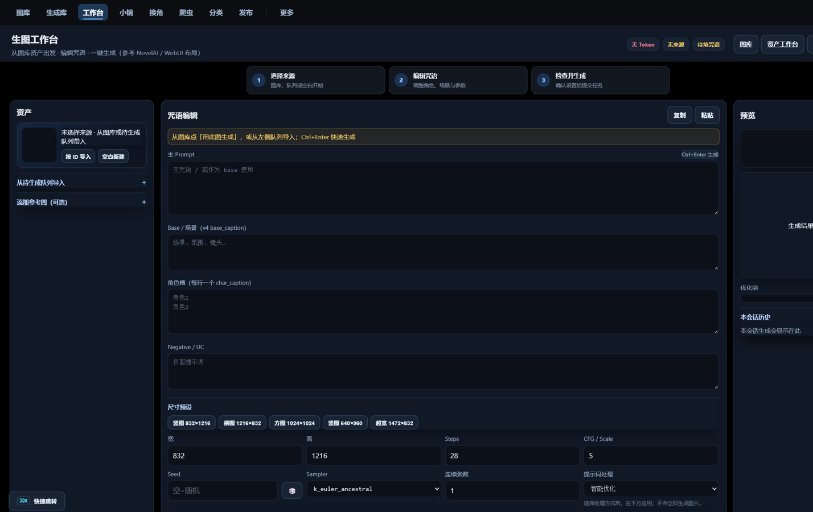
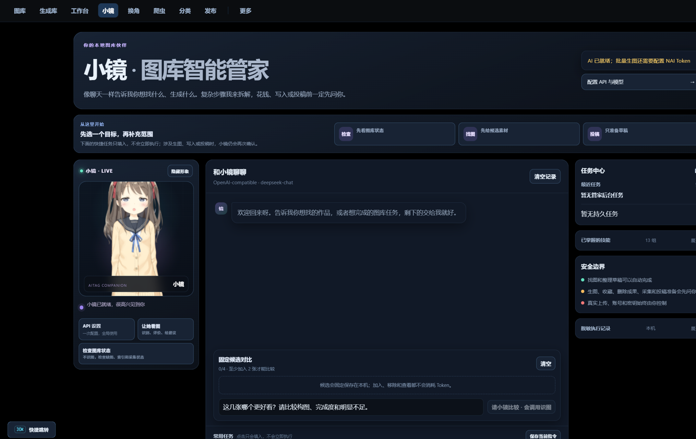

<div align="center">

# 🐾 Nai学长工作室

### Local-first NovelAI factory for illustration workflows

[English](README_EN.md)

**素材发现 · NAI 元数据验证 · Prompt 资产管理 · 角色换角 · 批量生成 · 后处理 · Pixiv 发布**


[下载 v1.4.0](https://github.com/h1neolzr7f/NaiXueZhang-Studio/releases/tag/v1.4.0) ·
[全部 Releases](https://github.com/h1neolzr7f/NaiXueZhang-Studio/releases) ·
[查看路线图](ROADMAP.md) ·
[参与贡献](CONTRIBUTING.md) ·
[责任与来源](RESPONSIBLE_USE.md)

</div>

> [!NOTE]
> **版本线说明：** 本仓库保留 **v1.4.0 稳定版**及其历史 Release，适合希望继续使用已冻结界面的用户。当前持续开发、面向新用户的 **v1.5+ 主线**已迁移到 [NaiXueZhang-Studio-Upgrade](https://github.com/h1neolzr7f/NaiXueZhang-Studio-Upgrade)。第一次安装建议直接下载 [v1.5.0 Windows 一键包](https://github.com/h1neolzr7f/NaiXueZhang-Studio-Upgrade/releases/tag/v1.5.0)。


> [!IMPORTANT]
> **非官方项目。** 本项目与 pixiv Inc.、NovelAI（Anlatan Inc.）及其他第三方平台不存在隶属、授权或合作关系。使用者应自行确认访问、下载、处理与发布行为符合适用法律、平台规则及第三方权利要求。维护者不为绕过访问控制、干扰平台运行、未经授权的数据采集或侵权传播提供支持。详见 [免责声明](DISCLAIMER.md) 与 [负责任使用说明](RESPONSIBLE_USE.md)。

## v1.4.0 修复版

当前官方 Windows 包是 **v1.4.0 修复版**（2026-08-13）。这是安全与可靠性修复，**不改已有本地图库用户的首页**，也不另开漫画、剪辑或新客户端。

相对 v1.3.0：

- **付费出图走任务队列**：点一次冻结参数；HTTP 5xx 有响应时不自动重试；崩溃恢复会标明这次可能已扣费。
- **会话令牌 fail-closed**：拿不到令牌就不写；401/403 只刷新一次。Token 输入框不回填明文。
- **非 Windows 拒绝明文存密钥**：无法 DPAPI 时不会把 NovelAI / Pixiv token 写进 `data/`。
- **小镜三条车道**：解答只读；检修只跑具名剧本（不改系统代理、不自动拉爬虫）；生产（生成 / 投稿准备 / 采集）必须确认工单。
- **空库默认发现而不是采集**：主图库为空时禁止启动或配置爬虫；请先用 AITag 看参考（发现结果不会写入主库）。
- **DOM 转义**：生成库队列、运营页、换角灯箱不再把 API `message` 或外部 URL 直接写进 `innerHTML`。
- **数据目录一致**：小镜自动模式写入当前 `data_dir()`；启动时缩略图/元数据维护失败会打 WARNING，不再静默吞掉。

请只从 [官方 Releases](https://github.com/h1neolzr7f/NaiXueZhang-Studio/releases) 下载，并用发布说明里的 SHA-256 核对压缩包。

## 它解决什么问题？

AI 绘图的难点往往不是“生成一张图”，而是长期管理数千张素材、Prompt、角色、来源、任务和发布记录。

Nai学长工作室把原本分散在浏览器、文件夹、脚本和多个工具中的流程，整理成一套可恢复、可检索、可追踪的本地工作台：



## 界面预览

当前深色工作台（2026-08 构建）：

<p align="center">
  
</p>

<p align="center">
  
  &nbsp;
  
</p>

## ✨ 核心亮点

| 能力 | 说明 |
|---|---|
| **严格 NAI 准入** | 逐页解析图片元数据，仅将可验证的 NovelAI 作品纳入目标图库 |
| **本地优先图库** | 图片、数据库、配置和任务状态默认保存在本机，不上传用户图库 |
| **在线冷启动资产** | 无需先运行爬虫，可从 AITag 在线发现源选择作品、图片和角色候选并建立零生成调用草稿 |
| **Prompt 与角色资产** | 搜索原始 Prompt、角色、作品、画师、动作、服装、场景与构图标签 |
| **批量创作流水线** | 角色换角、生成队列、多 Token 调度、失败恢复和生成结果管理 |
| **后处理闭环** | 超分、打码、元数据清理与发布前检查集中在同一工作流中 |
| **AI Butler** | 解答只读、检修走具名剧本、生产必须确认工单；不会静默改代理或拉起采集 |
| **来源追踪** | 保存作者、作品链接、源状态和作者声明，可导出来源清单 |
| **可恢复清理** | 按作者清理时先移动到本地回收区，再删除数据库索引 |

## 🧩 不只是一个爬虫

项目当前包含多个相互独立但可以组合的工作面：

- **图库与分类图谱**：本地检索、收藏、分面标签和大图库浏览；
- **素材发现**：搜索、作者、榜单与用户指定来源的候选发现；
- **Studio**：基于已有作品进入 Prompt 研究、换角和再创作；
- **生成队列**：多 Token、任务持久化、失败恢复和生成结果归档；
- **参考库与标签资产**：角色、画风、Vibe 与 Prompt 资产管理；
- **在线资产工作台**：按需浏览 AITag 元数据和多图详情，显式保存角色，或直接建立待确认的换角草稿；
- **Pipeline**：发布前图片处理、质量检查和本地自动化；
- **Pixiv 发布**：多账号配置、草稿准备、后处理约束和发布记录；
- **合规与来源**：作者黑名单、单作品排除、源状态、来源清单与本地清理。

## 🚀 快速开始

### 方式一：下载 Windows 版本

从 [Releases](https://github.com/h1neolzr7f/NaiXueZhang-Studio/releases) 下载 **v1.4.0** 便携包（`NaiXueZhang-Studio-v1.4.0-windows-one-click.zip`）。解压后双击「一键启动.bat」。程序启动后会打开：

```text
http://127.0.0.1:8797/
```

运行数据默认保存在程序同目录的 `data/`，发行包不包含任何用户 Token、Cookie、图库、生成历史或本地数据库。

### 方式二：从源码运行

需要 Windows 10/11 与 Python 3.13：

```powershell
git clone https://github.com/h1neolzr7f/NaiXueZhang-Studio.git
cd NaiXueZhang-Studio
python -m venv .venv
.\.venv\Scripts\Activate.ps1
python -m pip install -r requirements.core.lock.txt
python server.py
```

部分浏览器自动化、打包或扩展功能可能需要完整依赖，参见仓库中的 requirements 与 scripts。

## 🏗️ 技术结构

```text
FastAPI localhost service
├─ routes/              API 与页面路由
├─ web/                 本地 Web UI
├─ db.py                SQLite、FTS 与迁移
├─ pixiv_*              素材发现、账号与发布能力
├─ nai_*                NAI Token、生成、Prompt 与角色处理
├─ butler_*             AI Butler、工具权限与审计
├─ generated_gallery.py 生成结果与缩略图
├─ scripts/             验证、打包、敏感信息扫描与发布工具
└─ tests/               后端、前端契约、安全与持久化回归测试
```

关键工程特性：

- SQLite FTS 与大型图库索引；
- 任务持久化、断点恢复和原子文件写入；
- Windows DPAPI 本地凭据加密（非 Windows 拒绝把密钥明文写入 `data/`）；
- localhost 写操作会话令牌（失败则拒绝写入）；
- 付费生图任务持久化：5xx 不自动重试、崩溃标扣费未知；
- 更新包 HTTPS + SHA-256 校验；
- 路径越界保护与文件体积限制；
- 来源追踪、作者排除和可恢复清理。

## 🔐 隐私与安全

- 服务默认仅监听 `127.0.0.1`；
- NovelAI Token 与 Pixiv refresh token 在 Windows 上通过 DPAPI 加密落盘；非 Windows 无法加密时拒绝持久化密钥，不会把明文写入 `data/`；
- 本地图库、Prompt、生成记录和确认记录不上传到项目服务器；
- AITag 在线发现是可选第三方网络功能，只按需读取搜索、详情元数据和远程预览图；在线不可用时回退本地角色库，且浏览与建草稿不会调用 NovelAI Provider；
- 发布包会排除图片、数据库、缓存、凭据和本地运行日志；
- 官方 Release 可附带 Commit 与 SHA-256，便于识别非官方修改版。

安全问题请不要在公开 Issue 中粘贴 Token、Cookie、完整路径或私人素材，参见 [SECURITY.md](SECURITY.md)。

## 🧪 测试

```powershell
python -m pip install -r requirements.core.lock.txt pytest
python -m pytest -q
python scripts/scan_sensitive.py
```

公开版质量门槛重点覆盖：

- Token/refresh token 不得明文写盘；
- 来源状态、作者黑名单与来源清单；
- 按作者清理的磁盘与数据库一致性；
- 路径越界保护；
- 更新清单和安装包的 HTTPS/SHA-256 信任链；
- 前端 API 会话令牌与关键 UI 契约。

## 🤝 贡献

欢迎提交：

- Bug 修复与可复现测试；
- 大图库性能优化；
- Prompt、角色和标签资产改进；
- 本地优先的工作流与可用性优化；
- 文档、翻译和安装体验改进。

开始前请阅读 [CONTRIBUTING.md](CONTRIBUTING.md)。不要在 PR、Issue、测试数据或截图中提交第三方受版权保护的图片、真实凭据或私人运行数据。

## 🗺️ Roadmap

近期方向包括：

- Recipe 配方版本与生成血缘；
- NovelAI 参数实验室；
- 相似图、重复图和派生关系；
- 智能文件夹与系列项目；
- 个性化本地审美排序；
- 更完整的发布复盘和生产统计。

完整计划见 [ROADMAP.md](ROADMAP.md)。

## 📜 License

代码采用 [MIT License](LICENSE)。代码许可不授予任何第三方图片、Prompt、角色、商标或平台数据的权利。

本项目按现状提供；在适用法律允许的最大范围内，维护者不对使用本软件产生的损失承担担保或责任。完整边界见 [DISCLAIMER.md](DISCLAIMER.md)。

---

<div align="center">

### 觉得这个项目有意思？点一个 ⭐ 会让更多 AI 创作者看到它。

**v1.4.0 修复版** · 请从官方 Releases 下载并核对 SHA-256。欢迎 Issue 与 PR。

</div>
