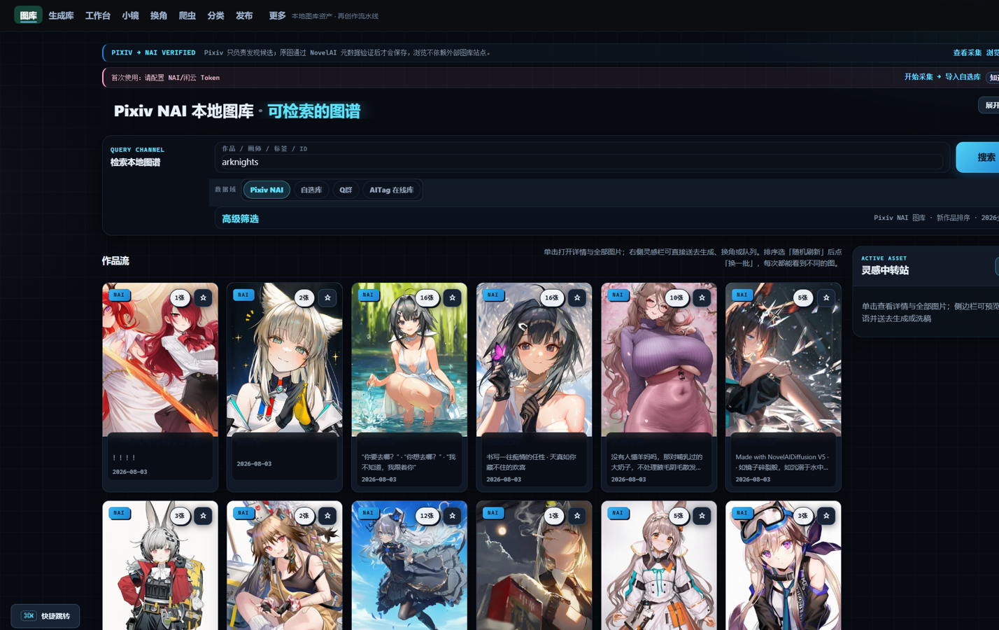

<div align="center">

# 🐾 NaiXueZhang Studio · v1.4 Stable

### Frozen local-first NovelAI workflow release

**This repository preserves the v1.4 interface, source history, and release downloads.**

[中文](README.md)

[Download v1.4.0](https://github.com/h1neolzr7f/NaiXueZhang-Studio/releases/tag/v1.4.0) ·
[Current v1.5+ development line](https://github.com/h1neolzr7f/NaiXueZhang-Studio-Upgrade) ·
[Roadmap](ROADMAP.md) ·
[Contributing](CONTRIBUTING.md)

</div>

> [!NOTE]
> New users should normally install [v1.5.0 from the current development line](https://github.com/h1neolzr7f/NaiXueZhang-Studio-Upgrade/releases/tag/v1.5.0). This repository remains available for users who want the frozen v1.4 interface and for historical review.

<p align="center">
  
</p>

## What v1.4 provides

- A searchable local gallery backed by SQLite FTS
- NovelAI metadata validation, prompt assets, and character replacement
- Persistent paid-generation queues with crash recovery
- Multi-token scheduling and generated-result management
- Upscaling, censorship, metadata cleanup, and publication checks
- Pixiv draft preparation, provenance, and recoverable cleanup
- Windows DPAPI credential protection and fail-closed local writes

## Quick start

Download and fully extract the [v1.4.0 Windows archive](https://github.com/h1neolzr7f/NaiXueZhang-Studio/releases/tag/v1.4.0), then run the included launcher. The local service opens at `http://127.0.0.1:8797/`.

From source:

```powershell
git clone https://github.com/h1neolzr7f/NaiXueZhang-Studio.git
cd NaiXueZhang-Studio
python -m venv .venv
.\.venv\Scripts\Activate.ps1
python -m pip install -r requirements.core.lock.txt
python server.py
```

## Privacy, status, and license

The service listens on `127.0.0.1` by default. Releases do not include user images, local databases, tokens, cookies, generation history, or runtime logs.

This is an unofficial project and is not affiliated with pixiv Inc., NovelAI/Anlatan, or other third-party services. See [DISCLAIMER.md](DISCLAIMER.md), [RESPONSIBLE_USE.md](RESPONSIBLE_USE.md), and [SECURITY.md](SECURITY.md).

Code is released under the [MIT License](LICENSE). The license does not grant rights to third-party images, prompts, characters, trademarks, or platform data.
